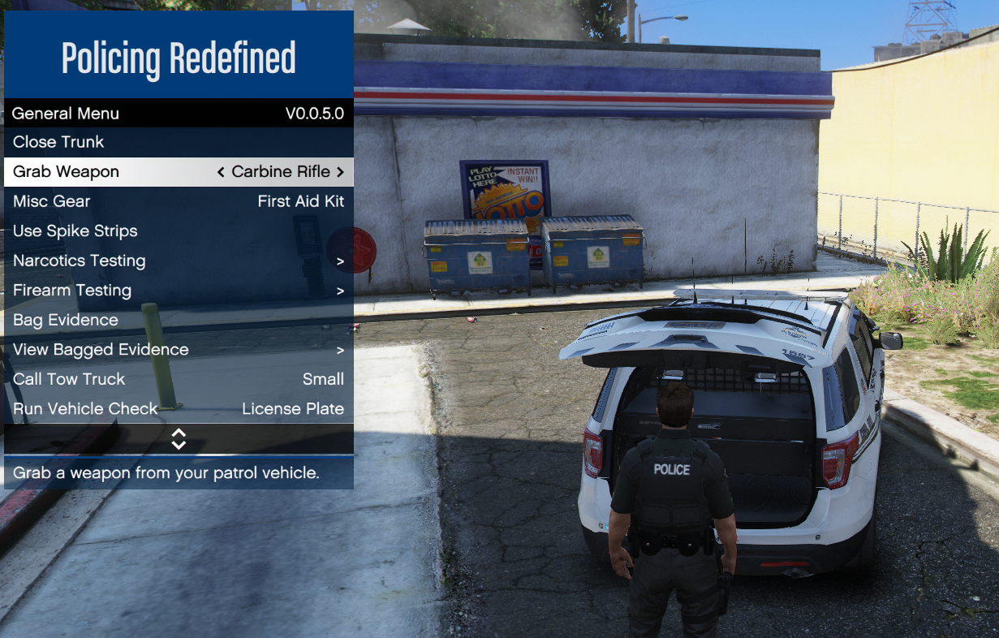

# Loadouts

PR allows you to predefine weapon loadouts of which the one marked as `IsDefaultLoadout` is
applied when the plugin is loaded.\
You can edit them in `Settings/Loadouts.xml` where a `Loadout` (wrapped in `<AllLoadouts>`) consists of the following:
- `LoadoutName`: The name of the loadout
- `IsDefaultLoadout`: Whether the loadout is the main loadout (see above)
- `LoadoutWeapons`: The weapons that the loadout contains
```xml
<Loadout LoadoutName="Patrol" IsDefaultLoadout="True">
    <LoadoutWeapons>
    ...
    </LoadoutWeapons>
</Loadout>
```

`LoadoutWeapons` is where you can define multiple `LoadoutWeapon` entries which consists of the
following:
- `WeaponHash`: A [weapon](https://docs.fivem.net/docs/game-references/weapon-models/)
- `StartingAmmoCount`: How much ammo this weapon should get when the loadout is equipped
- `IsVehicleWeapon`: Whether this weapon has to be retrieved from a patrol vehicle first
  - When set to `False` the weapon will be instantly given to your inventory
- `UseRackingAnimation`: Whether a small animation should be played when you retrieve the weapon from a patrol vehicle
- `WeaponLocation`: Where the weapon is located in the vehicle (`FrontDoors`, `Trunk`, `Any`)
- `WeaponTintIndex`: If set, the specified tint will be applied to the weapon
- `WeaponDisplayName`: The name that should be displayed in the patrol vehicle menu
- `WeaponComponents`: Entries of `WeaponComponent` consisting of a [`ComponentHash`](https://wiki.rage.mp/wiki/Weapons_Components)
```xml
<LoadoutWeapon WeaponHash="WEAPON_CARBINERIFLE" StartingAmmoCount="60" IsVehicleWeapon="true" UseRackingAnimation="true" WeaponLocation="FrontDoors" WeaponDisplayName="Carbine Rifle">
    <WeaponComponents>
        <WeaponComponent ComponentHash="COMPONENT_AT_AR_FLSH"/>
        <WeaponComponent ComponentHash="COMPONENT_AT_AR_AFGRIP"/>
    </WeaponComponents>
</LoadoutWeapon>
```



A default weapon loadout can look like this:
```xml
<AllLoadouts>
    <Loadout LoadoutName="Default Loadout" IsDefaultLoadout="true">
        <LoadoutWeapons>
            <LoadoutWeapon WeaponHash="WEAPON_PUMPSHOTGUN" StartingAmmoCount="20" IsVehicleWeapon="true"
                           WeaponLocation="FrontDoors" WeaponDisplayName="Pump Shotgun">
                <WeaponComponents>
                    <WeaponComponent ComponentHash="COMPONENT_AT_AR_FLSH"/>
                </WeaponComponents>
            </LoadoutWeapon>

            <LoadoutWeapon WeaponHash="WEAPON_CARBINERIFLE" StartingAmmoCount="60" IsVehicleWeapon="true"
                           UseRackingAnimation="true" WeaponLocation="FrontDoors" WeaponDisplayName="Carbine Rifle">
                <WeaponComponents>
                    <WeaponComponent ComponentHash="COMPONENT_AT_AR_FLSH"/>
                    <WeaponComponent ComponentHash="COMPONENT_AT_AR_AFGRIP"/>
                </WeaponComponents>
            </LoadoutWeapon>

            <LoadoutWeapon WeaponHash="WEAPON_GRENADELAUNCHER_SMOKE" StartingAmmoCount="20" IsVehicleWeapon="true"
                           WeaponLocation="Trunk" WeaponDisplayName="Smoke Launcher">
                <WeaponComponents>
                    <WeaponComponent ComponentHash="COMPONENT_AT_AR_FLSH"/>
                </WeaponComponents>
            </LoadoutWeapon>

            <LoadoutWeapon WeaponHash="WEAPON_PISTOL" StartingAmmoCount="90">
                <WeaponComponents>
                    <WeaponComponent ComponentHash="COMPONENT_AT_PI_FLSH"/>
                </WeaponComponents>
            </LoadoutWeapon>

            <LoadoutWeapon WeaponHash="WEAPON_STUNGUN">
                <WeaponComponents>
                </WeaponComponents>
            </LoadoutWeapon>

            <LoadoutWeapon WeaponHash="WEAPON_NIGHTSTICK">
                <WeaponComponents>
                </WeaponComponents>
            </LoadoutWeapon>
        </LoadoutWeapons>
    </Loadout>
    <!-- ...more loadouts here... -->
</AllLoadouts>
```


