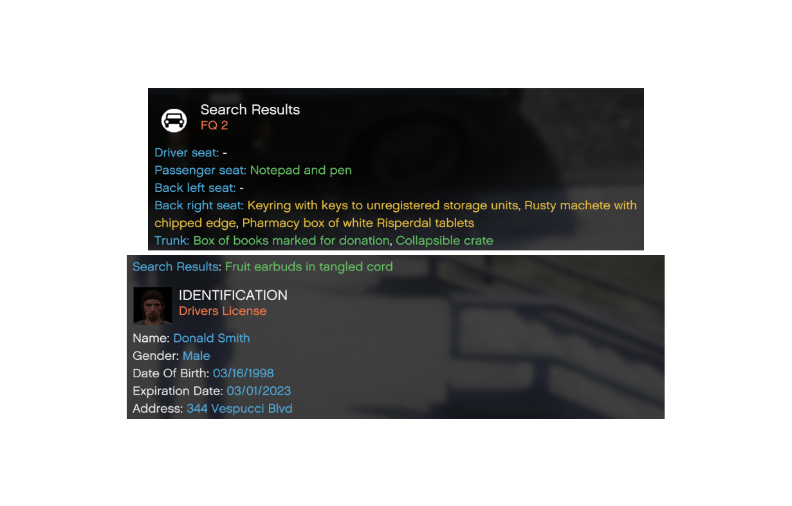

# Search Items

What would PR be without search items? Well guess what: they are even more advanced!\
`PatDownItems.xml` defines search items for ped searches while `VehicleSearchItems.xml` defines
search items for vehicle searches. Makes sense, right?\
In case you don't want to set up your own items, don't worry: We got you covered! 
PR already comes with the powerful **Search Items Reborn** made by Officer34 right out of the box!

The base of both files holds three entries:
```xml
<RedItems>
    ...
</RedItems>
<YellowItems>
    ...
</YellowItems>
<GreenItems>
    ...
</GreenItems>
```

Just like in STP the items are divided into the sections red, yellow and green which probabilities
can be edited in `InteractionSettings.ini`.\
In these sections you create your `Item` entries which consists of the following:
- `Chance`: The chance of the item within their section (`VeryRare`, `Rare`, `Normal`, `Often`, `VeryOften`)
- `ItemLocation` The location of the item for vehicle search items (`Anywhere`, `DriverSeat`, `PassengerSeat`, `BackLeftSeat`, `BackRightSeat`, `Trunk`)

A pat down item can be as simple as:
```xml
<Item Chance="VeryOften">Eyefind smartphone</Item>
```
Whereas a vehicle search item could be this (though not defining a location would randomize it):
```xml
<Item Chance="VeryOften" ItemLocation="PassengerSeat">Eyefind smartphone</Item>
```

Now, we promised more advanced search items, right? Unlike in other plugins where certain keywords
are used to define the type of search item, it's done through a `xsi:type` attribute in PR. In the examples
above, we didn't define it, therefore PR interprets them as "normal" search items.\
Let's define a `Firearm` which consists of the following:
- `FirearmState`: Whether the firearm has a scratched serial number (`Normal`, `ScratchedSN`)
- `IsStolen`: Whether the firearm should come out as stolen
- `WeaponModelId`: What kind of [weapon id](https://docs.fivem.net/docs/game-references/weapon-models/) this firearm item represents
- `IsVisible`: Whether this firearm is being carried open (affects observation)
```xml
<Item xsi:type="Firearm" Chance="Normal" FirearmState="Normal" WeaponModelId="WEAPON_PISTOL">Concealed Semi-Auto Pistol</Item>
```
You can also define a melee `Weapon` which consists of the following:
- `WeaponModelId`: What kind of [weapon id](https://docs.fivem.net/docs/game-references/weapon-models/) this weapon item represents
```xml
<Item xsi:type="Weapon" Chance="Normal" WeaponModelId="WEAPON_KNIFE">4-inch folding pocket knife</Item>
```
You can also define a `Drug` which consists of the following:
- `DrugType`: What kind of drug this item is
  - `Morphine`, `Heroin`, `Codeine`, `Oxycodone`, `Hydrocodone`, `Fentanyl`
  - `PCP`, `LSD`, `Mescaline`, `Psilocybin`, `Cannabis`
  - `Adderall`, `Concerta`, `Ritalin`, `Methamphetamine`, `Vyvanse`, `Cocaine`
  - `Risperdal`, `Seroquel`, `Abilify`, `Clozapine`
```xml
<Item xsi:type="Drug" Chance="Normal" DrugType="Adderall">Orange capsule with white powder</Item>
```

\
All these extra attributes not only affect the search system but also the evidence system
which will be taking a look at later!

