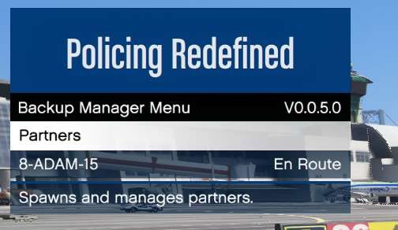

# Backup

:::tip
PR is able to convert and use your UB configs! [Click here](../installation/first-launch.md#switching-from-ultimate-backup) on how to achieve that.
:::

## `VehicleDivision`
Before explaining the structure of the config files, this is the equivalent of UB's `VehicleSet`
and is used through-out all config files. It's essentially a variation of a unit. It consists of:
- `spawn_distance`: The dispatch radius (in meters) of this division
- `chance`: The chance that this division is picked
- `name_list_id`: The [list of names](#customunitnamesxml) that this division should use
- `k9_model`: The model of the K9 used in a K9 unit definition (`chop`, `husky`, `shepherd`, `rottweiler`, `retriever`)
- `k9_tex_face`: The texture of the K9's face component
- `k9_tex_shirt`: The texture of the K9's shirt component
- `k9_tex_accessories`: The texture of the K9's accessories component
- `Peds`: List of [`Ped`](#ped) elements
- `Vehicles`: List of [`Vehicle`](#vehicle) elements
- `LongGuns`: List of [`LongGun`](#longgun) elements
- `HandGuns`: List of [`HandGun`](#handgun) elements
- `NonLethals`: List of [`NonLethal`](#nonlethal) elements
```xml
<VehicleDivision spawn_distance="250" chance="100">
    <Peds>
        <Ped>...</Ped>
        ...
    </Peds>
    <Vehicles>
        <Vehicle>...</Vehicle>
        ...
    </Vehicles>
    <LongGuns>
        <LongGun>...</LongGun>
        ...
    </LongGuns>
    <HandGuns>
        <HandGun>...</HandGun>
        ...
    </HandGuns>
    <NonLethals>
        <NonLethal>...</NonLethal>
        ...
    </NonLethals>
</VehicleDivision>
```

### `Ped`
...defines a variation of a backup ped within in a division:
- A [ped model name](https://docs.altv.mp/gta/articles/ped/models.html)
- `chance`: The chance that this ped variation is chosen
- `rain_outfit`: Whether this ped variation should be used when its raining
- `snow_outfit`: Whether this ped variation should be used when its snowing
- `comp_face`, `tex_face`: The ID of the face component and texture
- `comp_beard`, `tex_beard`: The ID of the beard component and texture
- `comp_hair`, `tex_hair`: The ID of the hair component and texture
- `comp_shirtoverlay`, `tex_shirtoverlay`: The ID of the shirt overlay component and texture
- `comp_shirt`, `tex_shirt`: The ID of the shirt component and texture
- `comp_decals`, `tex_decals`: The ID of the decals component and texture
- `comp_accessories`, `tex_accessories`: The ID of the accessories component and texture
- `comp_pants`, `tex_pants`: The ID of the pants component and texture
- `comp_shoes`, `tex_shoes`: The ID of the shoes component and texture
- `comp_eyes`, `tex_eyes`: The ID of the eyes component and texture
- `comp_tasks`, `tex_eyes`: The ID of the tasks component and texture
- `comp_hands`, `tex_hands`: The ID of the hands component and texture
- `random_props`: Whether props for this ped should be randomized upon spawning
- `prop_glasses`, `tex_glasses`: The ID of the glasses prop and texture
- `prop_hat`, `tex_hat`: The ID of the hat prop and texture
- `prop_ears`, `tex_ears`: The ID of the ears prop and texture
- `prop_watches`, `tex_watches`: The ID of the watches prop and texture
- `has_mask`: Whether this ped will be wearing a mask (used to fix face clipping)
- `add_armor`: The amount of armor to add to this ped upon spawning (> 0)
```xml
<Ped comp_beard="99"
     tex_beard="1"
     comp_shirtoverlay="188"
     comp_shirt="3"
     comp_accessories="23"
     tex_accessories="1"
     comp_pants="35"
     comp_shoes="12"
     comp_eyes="2"
     comp_tasks="18"
     comp_hands="67"
     chance="100">mp_m_freemode_01</Ped>
```
_(The example above uses random numbers fyi.)_

### `Vehicle`
...defines a variation of a vehicle within a division:
- A [vehicle model name](https://docs.altv.mp/gta/articles/vehicle/models.html)
- `chance`: The chance that this vehicle variation is chosen
- `color`: The color of the vehicle (either a `32-bit ARGB` value or a [color name](https://learn.microsoft.com/en-us/dotnet/api/system.drawing.color?view=net-9.0))
- `pax`: The amount of passengers this variation should have
- `pax_chance`: The chance that the passengers specified in `pax` spawn
- `livery`: The ID of a vehicle livery
- `extra_1`...`extra_12`: Whether this vehicle has a certain extra enabled (ignored for helicopters)
```xml
<Vehicle pax="1" pax_chance="50" chance="100">POLICE</Vehicle>
```
There is also a `ExtraData` attribute used to define settings for e.g. animal control and 
flatbed tow trucks specified by the `xsi:type` attribute:
- `AnimalControlData`:
  - `delete_animal`: Whether animal control units should just delete the animal
  - `offset_x`: The teleport and attachment offset of the animal along the width of the vehicle
  - `offset_y`: The teleport and attachment offset of the animal along the length of the vehicle
```xml
<Vehicle chance="100">
    REBEL2
    <ExtraData xsi:type="AnimalControlData"
               delete_animal="false"
               offset_x="0"
               offset_y="-1.7" />
</Vehicle>
```

- `TowTruckData`:
  - `offset_x`: The attachment offset of the vehicle along the width of the flatbed
  - `offset_y`: The attachment offset of the vehicle along the length of the flatbed
  - `offset_z`: The attachment offset of the vehicle along the height of the flatbed
```xml
<Vehicle chance="100">
    FLATBED
    <ExtraData xsi:type="TowTruckData"
               offset_x="0"
               offset_y="-2.2"
               offset_z="1" />
</Vehicle>
```

### `LongGun`
...defines a long gun (e.g. a rifle) variation that is given to each backup [`Ped`](#ped) of a division:
- A [weapon](https://docs.fivem.net/docs/game-references/weapon-models/)
- `chance`: The chance that this weapon is chosen
- `comp_1`...`comp_6`: [Components](https://wiki.rage.mp/wiki/Weapons_Components) that are applied to this weapon
```xml
<LongGun comp_1="COMPONENT_AT_AR_FLSH" comp_2="COMPONENT_AT_SCOPE_MEDIUM" chance="100">WEAPON_CARBINERIFLE</LongGun>
```

### `HandGun`
...defines a hand gun (e.g. a pistol) variation that is given to each backup ped of a division:
It uses the same definition as [`LongGun`](#longgun) above.

### `NonLethal`
...defines a non-lethal weapon (e.g. a tazer) that is given to each backup ped of a division:
- A [non-lethal weapon](https://docs.fivem.net/docs/game-references/weapon-models/)
```xml
<NonLethal>WEAPON_STUNGUN</NonLethal>
```

:::important
You should really ensure that long guns, hand guns and non-lethal weapons are **separated into
their lists** because our Police AI chooses between weapon lists during combat situations
based on different conditions, such as distance to the suspect and their weapon; having e.g. a
long gun defined in the hand gun list will lead to unwanted (or wanted...depending on how insane
you are tbh) combat behavior.
:::

## `DefaultRegions.xml`
Here are the config for the default units defined specific to world regions. A `LocalPatrol`,
or any other default backup unit, simply consists of:
```xml
<LocalPatrol>
    <LosSantosCity>
        <VehicleDivision>...</VehicleDivision>
        ...
    </LosSantosCity>
    <LosSantosCounty>
        <VehicleDivision>...</VehicleDivision>
        ...
    </LosSantosCounty>
    <BlaineCounty>
        <VehicleDivision>...</VehicleDivision>
        ...
    </BlaineCounty>
    <NorthYankton>
        <VehicleDivision>...</VehicleDivision>
        ...
    </NorthYankton>
    <CayoPerico>
        <VehicleDivision>...</VehicleDivision>
        ...
    </CayoPerico>
</LocalPatrol>
```
Where each world region consists of a list of [`VehicleDivision`](#vehicledivision).\
And yes, PR adds the ability to create configs for Cayo Perico!

## `CustomRegions.xml`
Here you can fine-tune your default backup units by making them specific to certain world zones!
You can find the list of required abbreviations along with their full name [here](https://wiki.rage.mp/wiki/Zone::getNameOfZone).
Using our `LocalPatrol` as example again, it is as simple as:
- `name`: Name of the custom region (equivalent to UB's `label`)
- `Zones`: List of `Zone` with a zone abbreviation as value each
- `VehicleDivisions`: List of [`VehicleDivision`](#vehicledivision)
```xml
<LocalPatrol>
    <CustomRegion name="Airport Patrol">
        <Zones>
            <Zone>AIRP</Zone>
            <Zone>DELSOL</Zone>
            <Zone>LOSPUER</Zone>
            <Zone>STAD</Zone>
        </Zones>
        <VehicleDivisions>
            <VehicleDivision>...</VehicleDivision>
            ...
        </VehicleDivisions>
    </CustomRegion>
    ...
</LocalPatrol>
```
:::warning
A single unit **cannot** have several custom regions using the same zone. Though that should also
be common sense.
:::

## `SpecialUnits.xml`
Here you can create your own `SpecialUnit` unit which is basically a mix of a default and custom unit entry:
- `name`: The name of the special unit
- `role`: The role (AI) of the special unit (`cop`, `swat`, `medic`, `firefighter`)
- `code_1`: Whether this unit counts as code-1 backup
- `code_2`: Whether this unit counts as code-2 backup
- `code_3`: Whether this unit counts as code-3 backup
- `pursuit`: Whether this unit counts as pursuit backup
- `traffic_stop`: Whether this unit counts as traffic stop backup
- `felony_stop`: Whether this unit counts as felony stop backup
- `has_k9`: Whether this unit is a K9 unit
- `LosSantosCity`, `LosSantosCounty`, `BlaineCounty`, `NorthYankton`, `CayoPerico`:
Each a list of `VehicleDivision` just like in [`DefaultRegions.xml`](#defaultregionsxml)
- `CustomRegions`: List of `CustomRegion` just like in [`CustomRegions.xml`](#customregionsxml)
```xml
<SpecialUnit name="Local Bicycle Patrol" role="cop" code_1="true" code_2="true">
    <LosSantosCity>
        <VehicleDivision>...</VehicleDivision>
        ...
    </LosSantosCity>
    <LosSantosCounty>...</LosSantosCounty>
    <BlaineCounty>...</BlaineCounty>
    <NorthYankton>...</NorthYankton>
    <CayoPerico>...</CayoPerico>
    <CustomRegions>
        <CustomRegion>...</CustomRegion>
        ...
    </CustomRegions>
</SpecialUnit>
```
:::warning
Currently PR does **not** support special units that have air vehicles, therefore you
cannot define special air units. Doing so will lead to undefined behavior and such reports will
be **ignored**. This feature is planned for the future though!
:::

## `CustomUnitNames.xml`
This is an additional fourth file allowing you to create list of names that you can assign to a
[`VehicleDivision`](#vehicledivision). When PR spawns that vehicle division it will choose a
currently inactive name of the specified list and assign it to that unit. This way your units
won't be called e.g. `LocalPatrol-1`, `LocalPatrol-2`, ..., but instead you can give them realistic
names: perfect for immersion!\
This is how to declare a `CustomNameList`:
- `id`: The ID of this name list
- A list of `Name`
```xml
<CustomNameList id="div8_adam">
    <Name>8-ADAM-15</Name>
    ...
</CustomNameList>
```
And to your vehicle division you then add the `name_list_id` attribute:
```xml
<VehicleDivision spawn_distance="250" chance="100" name_list_id="div8_adam">...</VehicleDivision>
```

Simple as that! :)\
